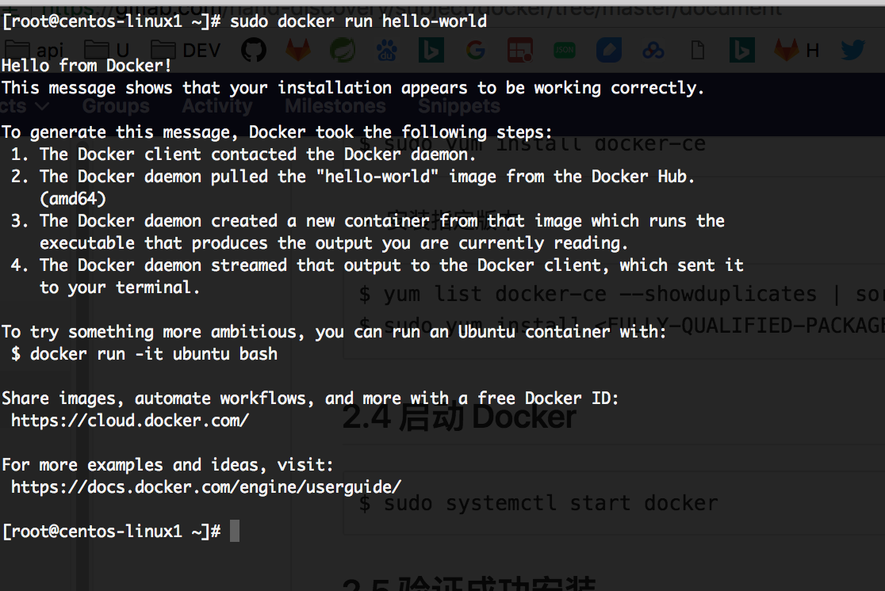

# 文档
## 1. Docker简介
### 1.1 什么是Docker，who am i?
Docker是一个开源项目，是一个能够把开发的应用程序自动部署到容器的开源引擎，诞生于2013年，基于go语言实现，项目代码在GitHub上维护

### 1.2 Docker与传统虚拟化方式的区别
看图：


比如同时运行在一台linux服务器上
- Docker与其他容器分享系统内核,内存消耗低，轻量级
- 相比之下,一个虚拟机(VM)运行一个完整的“GUEST OS”操作系统通过一个系统管理程序与虚拟主机资源的访问。一般来说,虚拟机提供一个环境比大多数应用程序需要更多的资源。

### 1.3 为什么使用Docker why usr it?
- 更快的交付于部署，**快**
    - 开发者可以使用一个标准的镜像来构建一套开发容器,开发完成后，运维人员可以直接使用这个容器部署代码
    - Docker容器很轻很快，启动快，大量节约开发、测试、部署的时间
- 更高效的虚拟化，**高效**
    - 运行不需要额外的hypervisor（虚拟机监控程序）支持，是内核级的虚拟化，可实现更高性能更高效率
- 更轻松的迁移与扩展，**易迁移**
    - Docker容器几乎可以在任意平台运行，如：物理机、虚拟机、共有云、私有云、个人PC、服务器等，这种兼容性可以让用户把应用程序从一个平台迁移到另外一个
- 更简单的管理，**易管理**
    - 只需要小小的修改,就可替代以往大量的更新工作，所有的修改以增量的形式分发和更新，从而实现自动化并高效的管理

### 1.4 基本概念
Docker包括三个基本概念
- 镜像 Image
- 容器 Container
- 仓库 Repository

#### 1.4.1 镜像 Image
- Docker 镜像就是一个只读的模板，例如：一个镜像包含了一个完成的centerOS操作系统环境，里面仅安装了jdk
- 镜像可以用来创建Docker容器
    - Docker 提供了一个很简单的机制来创建镜像或者更新现有的镜像，用户甚至可以直接从他人那里下载一个已经做好的镜像直接使用
    
#### 1.4.2 容器 Container  
- Docker 利用容易来运行应用
- 容器是从镜像创建的运行实例，它可以被启动、开始、停止、删除。每个容器都是相互隔离的、保证安全的平台

#### 1.4.3 仓库 Repository
- 仓库是集中存放镜像的仓所
- 仓库注册服务器（Registry）：存放多个仓库，每个仓库包含多个镜像，每个镜像有着自己的tag
- 仓库分为共有（public）、私有（private）
    - 最大共有仓库：[docker hub](https://hub.docker.com/explore/)
- 用户在本地网络创建一个私有仓库

### 1.5 Docker版本与区别
自从1.13版后Docker 分两种版本  Community Edition (CE) 和 Enterprise Edition (EE)


Docker CE 有两种更新渠道 `Stable` 和 `Edge`
- Stable gives you reliable updates every quarter,Stable每个季度更新一次
- Edge gives you new features every month,Edge每个月更新一次

## 2. Docker 的安装
### 2.1 准备
 Docker CE for CentOS，[官方参考](https://docs.docker.com/install/linux/docker-ce/centos/)
 ```
To install Docker CE, you need a maintained version of CentOS 7. Archived versions aren’t supported or tested.
The centos-extras repository must be enabled. This repository is enabled by default, but if you have disabled it, you need to re-enable it.
The overlay2 storage driver is recommended.
```
- Docker CE 需要CentOS 7
- 必须启用centos-extras 软件源
- 建议使用overlay2文件驱动

### 2.1 卸载老版本 Uninstall old versions
```
Older versions of Docker were called docker or docker-engine. If these are installed, uninstall them, along with associated dependencies.
```
卸载：
```
$ sudo yum remove docker \
                  docker-client \
                  docker-client-latest \
                  docker-common \
                  docker-latest \
                  docker-latest-logrotate \
                  docker-logrotate \
                  docker-selinux \
                  docker-engine-selinux \
                  docker-engine
```
- 文件夹 `/var/lib/docker/`中包括： images, containers, volumes,  networks

### 2.2 安装方式
- 软件仓库安装
- RPM包安装,文档略,[参考官方文档](https://docs.docker.com/install/linux/docker-ce/centos/#install-from-a-package) 
- 自动化脚本安装,文档略,[参考官方文档](https://docs.docker.com/install/linux/docker-ce/centos/#install-using-the-convenience-script) 

#### 2.2.1 软件仓库安装
- 1.安装依赖包

```
$ sudo yum install -y yum-utils \
  device-mapper-persistent-data \
  lvm2
```
- 2.1 安装仓库（stable更新模式,每季度更新一次）

```
$ sudo yum-config-manager \
    --add-repo \
    https://download.docker.com/linux/centos/docker-ce.repo
```
- 2.2 可选择的，启用edge和test（每月更新一次），他们包含在`docker.repo`中

```
$ sudo yum-config-manager --enable docker-ce-edge
$ sudo yum-config-manager --enable docker-ce-test
```
禁用

```
$ sudo yum-config-manager --disable docker-ce-edge
```

## 2.3 安装 卸载Docker CE
- 安装最新版本

```
$ sudo yum install docker-ce
```
- 安装指定版本

```
$ yum list docker-ce --showduplicates | sort -r
$ sudo yum install <FULLY-QUALIFIED-PACKAGE-NAME>
```
## 2.4 启动 Docker 

```
$ sudo systemctl start docker
```
## 2.5 验证成功安装
 - 为了验证是否成功安装，运行一下hello world镜像

 ```
$ sudo docker run hello-world
```
 
 
 
## 2.6 卸载Docker CE

```
$ sudo yum remove docker-ce
$ sudo rm -rf /var/lib/docker
```